# Nubenetes V2 | The High-Density Library (2026)

!!! quote "The Library of 2026"
    A meticulously curated reference of over 15,000 resources. This V2 portal preserves technical depth while providing     chronological clarity and expert quality synthesis.

[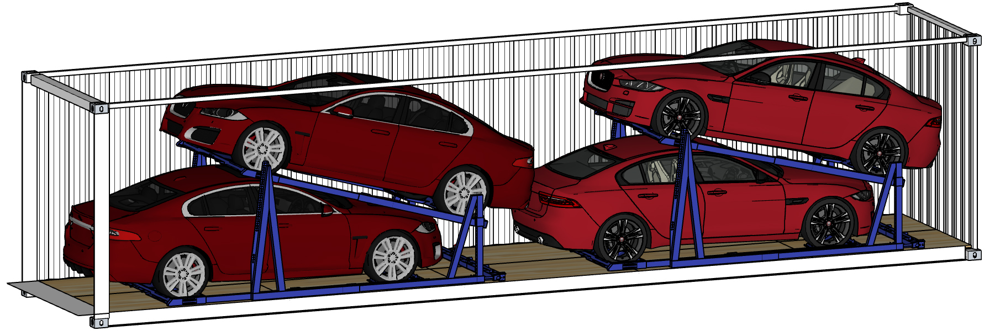](https://www.cncf.io/certification/software-conformance/)  

## 🌟 Master Selection (Top-Tier Gems)
A global selection of the most impactful resources across all dimensions.

??? note "Elite Video Selection - Click to expand!"
    

    <iframe width="560" height="315" src="https://www.youtube.com/embed/BE77h7dmoQU" title="YouTube video player" frameborder="0" allow="accelerometer; autoplay; clipboard-write; encrypted-media; gyroscope; picture-in-picture" allowfullscreen></iframe>
    <iframe width="560" height="315" src="https://www.youtube.com/embed/318elIq37PE" title="YouTube video player" frameborder="0" allow="accelerometer; autoplay; clipboard-write; encrypted-media; gyroscope; picture-in-picture" allowfullscreen></iframe>
    <iframe width="560" height="315" src="https://www.youtube.com/embed/HlAXp0-M6SY?clip=UgkxWpu3QFPEDZBuMgy_Xq4mBR--uLA-3CSZ&amp;clipt=EMSoKxiG3C4" title="YouTube video player" frameborder="0" allow="accelerometer; autoplay; clipboard-write; encrypted-media; gyroscope; picture-in-picture" allowfullscreen></iframe>
    <iframe width="560" height="315" src="https://www.youtube.com/embed/rT4fJNbfe14" title="YouTube video player" frameborder="0" allow="accelerometer; autoplay; clipboard-write; encrypted-media; gyroscope; picture-in-picture; web-share" allowfullscreen></iframe>
    <iframe width="560" height="315" src="https://www.youtube.com/embed/FUu4kMc0PL8?clip=UgkxFMdlFKBQze7NVVd7q2nIwBYWkeaKeoX8&amp;clipt=EIzBzwIY1fnSAg" title="YouTube video player" frameborder="0" allow="accelerometer; autoplay; clipboard-write; encrypted-media; gyroscope; picture-in-picture" allowfullscreen></iframe>
    <iframe width="560" height="315" src="https://www.youtube.com/embed/FUu4kMc0PL8?clip=UgkxLbUzIJtyeKPi66qAvxxRlGbofYp_Gr8B&amp;clipt=EIDy0gIY4MbWAg" title="YouTube video player" frameborder="0" allow="accelerometer; autoplay; clipboard-write; encrypted-media; gyroscope; picture-in-picture" allowfullscreen></iframe>
    <iframe width="560" height="315" src="https://www.youtube.com/embed/UmbjwSK9b3I?clip=UgkxRGuBMDAVDqKckQ1lhk-9U2jLBhBIBI5l&amp;clipt=EP2dHhjd8iE" title="YouTube video player" frameborder="0" allow="accelerometer; autoplay; clipboard-write; encrypted-media; gyroscope; picture-in-picture" allowfullscreen></iframe>
    <iframe width="560" height="315" src="https://www.youtube.com/embed/ghzsBm8vOms" title="YouTube video player" frameborder="0" allow="accelerometer; autoplay; clipboard-write; encrypted-media; gyroscope; picture-in-picture; web-share" allowfullscreen></iframe>
    <iframe width="560" height="315" src="https://www.youtube.com/embed/rkXGSLf-rVQ?si=Ho8Zzxbrecn7Yncb" title="YouTube video player" frameborder="0" allow="accelerometer; autoplay; clipboard-write; encrypted-media; gyroscope; picture-in-picture; web-share" allowfullscreen></iframe>
    <iframe width="560" height="315" src="https://www.youtube.com/embed/IFUPG9KCJ4E?si=KMEXeVlcKTp87-Ja" title="YouTube video player" frameborder="0" allow="accelerometer; autoplay; clipboard-write; encrypted-media; gyroscope; picture-in-picture; web-share" allowfullscreen></iframe>
    <iframe width="560" height="315" src="https://www.youtube.com/embed/PxyyY7TsCqs?si=kzCRojDteESqork1" title="YouTube video player" frameborder="0" allow="accelerometer; autoplay; clipboard-write; encrypted-media; gyroscope; picture-in-picture; web-share" allowfullscreen></iframe>
    <iframe width="560" height="315" src="https://www.youtube.com/embed/I8Qh-TafMvQ?si=1A2-kmq6mV-S-03c" title="YouTube video player" frameborder="0" allow="accelerometer; autoplay; clipboard-write; encrypted-media; gyroscope; picture-in-picture; web-share" allowfullscreen></iframe>
    <iframe width="560" height="315" src="https://www.youtube.com/embed/V7PSnH8YnTk?si=6Mq4wjpipTLwUvYe" title="YouTube video player" frameborder="0" allow="accelerometer; autoplay; clipboard-write;
    encrypted-media; gyroscope; picture-in-picture; web-share" allowfullscreen></iframe>
    <iframe width="560" height="315" src="https://www.youtube.com/embed/1Fl25dR01pw?si=bJlQozIfT3J4rhN3" title="YouTube video player" frameborder="0" allow="accelerometer; autoplay; clipboard-write; encrypted-media; gyroscope; picture-in-picture; web-share" allowfullscreen></iframe>
    <iframe width="560" height="315" src="https://www.youtube.com/embed/L8eJh1sfc1U?si=y546MyZpRe-thoad" title="YouTube video player" frameborder="0" allow="accelerometer; autoplay; clipboard-write; encrypted-media; gyroscope; picture-in-picture; web-share" allowfullscreen></iframe>
    <iframe width="560" height="315" src="https://www.youtube.com/embed/U_IFGpJDbeU?si=XzHSGU9dTH-1_0EW" title="YouTube video player" frameborder="0" allow="accelerometer; autoplay; clipboard-write; encrypted-media; gyroscope; picture-in-picture; web-share" allowfullscreen></iframe>
    <iframe width="560" height="315" src="https://www.youtube.com/embed/8g4qLzkpjeE?si=xcfl3ugsMGZ8Kthg" title="YouTube video player" frameborder="0" allow="accelerometer; autoplay; clipboard-write; encrypted-media; gyroscope; picture-in-picture; web-share" allowfullscreen></iframe>
    <iframe width="560" height="315" src="https://www.youtube.com/embed/nrhxNNH5lt0?si=U5h1mbkbF6ZEOvlj" title="YouTube video player" frameborder="0" allow="accelerometer; autoplay; clipboard-write; encrypted-media; gyroscope; picture-in-picture; web-share" allowfullscreen></iframe>
    <iframe width="560" height="315" src="https://www.youtube.com/embed/cdZZpaB2kDM?clip=UgkxWAPHZbVaNZzk9pi0lMu6k5ABLuMHBtRL&amp;clipt=EK2rfRjW9YAB" title="YouTube video player" frameborder="0" allow="accelerometer; autoplay; clipboard-write; encrypted-media; gyroscope; picture-in-picture" allowfullscreen></iframe>
    <iframe width="560" height="315" src="https://www.youtube.com/embed/aZ5EsdnpLMI?si=ESsNnVwE8IdWSiWZ" title="YouTube video player" frameborder="0" allow="accelerometer; autoplay; clipboard-write; encrypted-media; gyroscope; picture-in-picture; web-share" allowfullscreen></iframe>
    <iframe width="560" height="315" src="https://www.youtube.com/embed/uQz0TpyJbE8?si=Ys-bXCWcoG-nDU1h" title="YouTube video player" frameborder="0" allow="accelerometer; autoplay; clipboard-write; encrypted-media; gyroscope; picture-in-picture; web-share" allowfullscreen></iframe>
    <iframe width="560" height="315" src="https://www.youtube.com/embed/hAwtrJlBVJY?si=bnyptzNFx4jzOiEj" title="YouTube video player" frameborder="0" allow="accelerometer; autoplay; clipboard-write; encrypted-media; gyroscope; picture-in-picture; web-share" allowfullscreen></iframe>
    <iframe width="560" height="315" src="https://www.youtube.com/embed/Hc8emNr2igU?si=kehLRUpOAvyK_Bku" title="YouTube video player" frameborder="0" allow="accelerometer; autoplay; clipboard-write; encrypted-media; gyroscope; picture-in-picture; web-share" referrerpolicy="strict-origin-when-cross-origin" allowfullscreen></iframe>
    <iframe width="560" height="315" src="https://www.youtube.com/embed/videoseries?si=zdATyq_E2wXN7AC6&amp;list=PLbMP1JcGBmSGKO8UreWpOBOhCqilejhtd" title="YouTube video player" frameborder="0" allow="accelerometer; autoplay; clipboard-write; encrypted-media; gyroscope; picture-in-picture; web-share" referrerpolicy="strict-origin-when-cross-origin" allowfullscreen></iframe>
    <iframe width="560" height="315" src="https://www.youtube.com/embed/videoseries?si=GBJtqv36O8bslj9z&amp;list=PLvBBnHmZuNQJeznYL2F-MpZYBUeLIXYEe" title="YouTube video player" frameborder="0" allow="accelerometer; autoplay; clipboard-write; encrypted-media; gyroscope; picture-in-picture; web-share" referrerpolicy="strict-origin-when-cross-origin" allowfullscreen></iframe>
    <iframe width="560" height="315" src="https://www.youtube.com/embed/MRIv2IwFTPg?si=F07g869i6yIfqRdg" title="YouTube video player" frameborder="0" allow="accelerometer; autoplay; clipboard-write; encrypted-media; gyroscope; picture-in-picture; web-share" referrerpolicy="strict-origin-when-cross-origin" allowfullscreen></iframe>
    <iframe width="560" height="315" src="https://www.youtube.com/embed/videoseries?si=fJvBV63-mjQ6S-Ht&amp;list=PL7sEPiUbBLo_iTds-NV-9Tu05Gg2Aj8N7" title="YouTube video player" frameborder="0" allow="accelerometer; autoplay; clipboard-write; encrypted-media; gyroscope; picture-in-picture; web-share" referrerpolicy="strict-origin-when-cross-origin" allowfullscreen></iframe>

    

## Strategic Dimensions
- **[Intelligent Control Plane](./intelligent-control-plane.md)**: Comprehensive chronological reference library for Intelligent Control Plane.
- **[Architectural Foundations](./architectural-foundations.md)**: Comprehensive chronological reference library for Architectural Foundations.
- **[Platform & Site Reliability](./platform-and-site-reliability.md)**: Comprehensive chronological reference library for Platform & Site Reliability.
- **[Hardened Infrastructure](./hardened-infrastructure.md)**: Comprehensive chronological reference library for Hardened Infrastructure.
- **[Cloud Providers (Hyperscalers)](./cloud-providers-hyperscalers.md)**: Comprehensive chronological reference library for Cloud Providers (Hyperscalers).
- **[Networking & Service Mesh](./networking-and-service-mesh.md)**: Comprehensive chronological reference library for Networking & Service Mesh.
- **[The Container Stack](./the-container-stack.md)**: Comprehensive chronological reference library for The Container Stack.
- **[Data & Advanced Analytics](./data-and-advanced-analytics.md)**: Comprehensive chronological reference library for Data & Advanced Analytics.
- **[Engineering Pipeline](./engineering-pipeline.md)**: Comprehensive chronological reference library for Engineering Pipeline.
- **[Developer Ecosystem](./developer-ecosystem.md)**: Comprehensive chronological reference library for Developer Ecosystem.
- **[Career & Industry](./career-and-industry.md)**: Comprehensive chronological reference library for Career & Industry.

---

[{: style="width:7%"}](https://www.youtube.com/c/DockerIo) [{: style="width:7%"}](https://www.youtube.com/c/cloudnativefdn) [{: style="width:7%"}](https://www.youtube.com/kubernetescommunity) [{: style="width:7%"}](https://www.youtube.com/c/redhat) [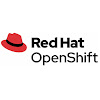{: style="width:7%"}](https://www.youtube.com/c/OpenShift) [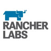{: style="width:7%"}](https://www.youtube.com/c/Rancher) [{: style="width:7%"}](https://www.youtube.com/c/CloudBeesTV) [{: style="width:7%"}](https://www.youtube.com/c/jenkinscicd) [{: style="width:7%"}](https://www.youtube.com/channel/UCN2kblPjXKMcjjVYmwvquvg) [{: style="width:7%"}](https://www.youtube.com/channel/UCcxQbw8kT1-FRhFhO2QCetg) [{: style="width:7%"}](https://www.youtube.com/c/VMwareTanzu) 
[{: style="width:7%"}](https://www.youtube.com/c/IBMTechnology) [{: style="width:7%"}](https://www.youtube.com/c/amazonwebservices) [{: style="width:7%"}](https://www.youtube.com/user/googlecloudplatform/) [{: style="width:7%"}](https://www.youtube.com/c/MicrosoftAzure) [{: style="width:7%"}](https://www.youtube.com/c/OracleCloudInfrastructure) [{: style="width:7%"}](https://www.youtube.com/c/Digitalocean) [{: style="width:7%"}](https://www.youtube.com/cloudflare) [{: style="width:7%"}](https://www.youtube.com/c/Scaleway-Cloud) [{: style="width:7%"}](https://www.youtube.com/c/OpenStackFoundation) [{: style="width:7%"}](https://www.youtube.com/c/HashiCorp) [{: style="width:7%"}](https://www.youtube.com/c/PulumiTV)  
[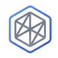{: style="width:7%"}](https://www.youtube.com/c/dzone/) [{: style="width:7%"}](https://www.youtube.com/c/PrometheusIo) [{: style="width:7%"}](https://www.youtube.com/c/Grafana) [{: style="width:7%"}](https://www.youtube.com/c/Istio) [{: style="width:7%"}](https://www.youtube.com/c/Elastic) [{: style="width:7%"}](https://www.youtube.com/c/dynatrace) [{: style="width:7%"}](https://www.youtube.com/c/appdynamics) [{: style="width:7%"}](https://www.youtube.com/c/NewRelicInc) [{: style="width:7%"}](https://www.youtube.com/channel/UC8uN3yhpeBeerGNwDiQbcgw) [{: style="width:7%"}](https://www.youtube.com/c/WeaveWorksInc) [{: style="width:7%"}](https://www.youtube.com/c/LambdaTest) 
[{: style="width:7%"}](https://www.youtube.com/c/Atlassian) [{: style="width:7%"}](https://www.youtube.com/user/deiserteam) [{: style="width:7%"}](https://www.youtube.com/c/Code) [{: style="width:7%"}](https://www.youtube.com/c/GitHub) [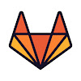{: style="width:7%"}](https://www.youtube.com/c/Gitlab) [{: style="width:7%"}](https://www.youtube.com/c/Gitkraken) [{: style="width:7%"}](https://www.youtube.com/c/RocketChatApp) [{: style="width:7%"}](https://www.youtube.com/c/Slackhq) [{: style="width:7%"}](https://www.youtube.com/c/MattermostHQ) [{: style="width:7%"}](https://www.youtube.com/c/microsoft365) [{: style="width:7%"}](https://www.youtube.com/c/OpenProjectCommunity) [{: style="width:7%"}](https://www.youtube.com/c/Tetrate) 
[{: style="width:7%"}](https://www.youtube.com/c/RedHatDevelopers) [{: style="width:7%"}](https://www.youtube.com/user/SpringSourceDev) [{: style="width:7%"}](https://www.youtube.com/c/Quarkusio) [{: style="width:7%"}](https://www.youtube.com/c/Lightbend-TV) [{: style="width:7%"}](https://www.youtube.com/c/postman) [{: style="width:7%"}](https://www.youtube.com/c/Smartbear) [{: style="width:7%"}](https://www.youtube.com/c/JFrogInc) [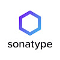{: style="width:7%"}](https://www.youtube.com/c/Sonatypeinc) [{: style="width:7%"}](https://www.youtube.com/channel/UCS5-gTYteN9rnFd98YxYtrA) [{: style="width:7%"}](https://www.youtube.com/c/GoogleChromeDevelopers) [{: style="width:7%"}](https://www.youtube.com/c/MozillaDeveloper) 
[{: style="width:7%"}](https://www.youtube.com/c/CrunchyDataPostgres) [{: style="width:7%"}](https://www.youtube.com/channel/UC5qMsRjObu685rTBq0PJX8w) [{: style="width:7%"}](https://www.youtube.com/c/cockroachdb) [{: style="width:7%"}](https://www.youtube.com/c/MongoDBofficial) [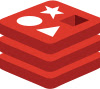{: style="width:7%"}](https://www.youtube.com/c/Redisinc) [{: style="width:7%"}](https://www.youtube.com/c/Confluent) [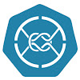{: style="width:7%"}](https://www.youtube.com/channel/UCud7fErZAyMC6lHT_cWZNfA) [{: style="width:7%"}](https://www.youtube.com/channel/UC3ywadaAUQ1FI4YsHZ8wa0g) [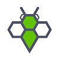{: style="width:7%"}](https://www.youtube.com/channel/UCm63IQg81KP9vXRWSHQpu1w) [{: style="width:7%"}](https://www.youtube.com/channel/UCt7N400Z8gB_3yKq1qrjP2w) [{: style="width:7%"}](https://www.youtube.com/c/Portworx) 
[{: style="width:7%"}](https://www.youtube.com/c/Cloudacademy) [{: style="width:7%"}](https://www.youtube.com/c/AcloudGuru) [{: style="width:7%"}](https://www.youtube.com/c/Devopsdotcom) [{: style="width:7%"}](https://www.youtube.com/c/XebiaLabs) [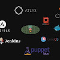{: style="width:7%"}](https://www.youtube.com/c/Devopslibrary) [{: style="width:7%"}](https://www.youtube.com/c/codecademy) [{: style="width:7%"}](https://www.youtube.com/user/coursera) [{: style="width:7%"}](https://www.youtube.com/c/Academind) [{: style="width:7%"}](https://www.youtube.com/c/guru99comm) [{: style="width:7%"}](https://www.youtube.com/c/Intellipaat) [{: style="width:7%"}](https://www.youtube.com/channel/UCv9MUffHWyo2GgLIDLVu0KQ) 
[{: style="width:7%"}](https://www.youtube.com/c/Thetips4you) [{: style="width:7%"}](https://www.youtube.com/channel/UC57acx8sCmE7uFHfVMvIlNg) [{: style="width:7%"}](https://www.youtube.com/c/NTFAQGuy) [{: style="width:7%"}](https://www.youtube.com/channel/UCorFV-WGnajyfNu4zPI0AAA) [{: style="width:7%"}](https://www.youtube.com/c/AppsCodeInc) [{: style="width:7%"}](https://www.youtube.com/c/DevOpsToolkit) [{: style="width:7%"}](https://www.youtube.com/c/AnsiblePilot) [{: style="width:7%"}](https://www.youtube.com/CodelyTV) [{: style="width:7%"}](https://www.youtube.com/c/PeladoNerd) [{: style="width:7%"}](https://www.youtube.com/c/HolaMundoDev) [{: style="width:7%"}](https://www.youtube.com/c/JavierGarz%C3%A1s/) 
[{: style="width:7%"}](https://www.youtube.com/c/LondonIAC) [{: style="width:7%"}](https://www.youtube.com/c/TechWorldwithNana) [{: style="width:7%"}](https://www.youtube.com/c/Honeypotio) [{: style="width:7%"}](https://www.youtube.com/c/AliSpittelDev) [{: style="width:7%"}](https://www.youtube.com/c/ThomasMaurerCloud) [{: style="width:7%"}](https://www.youtube.com/c/Freecodecamp) [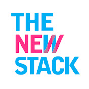{: style="width:7%"}](https://www.youtube.com/c/TheNewStack) [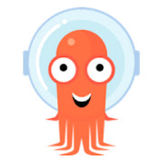{: style="width:7%"}](https://www.youtube.com/channel/UCOvYmppcbOPm1viN6ust3lA) [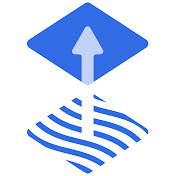{: style="width:7%"}](https://www.youtube.com/channel/UCoZxt-YMhGHb20ZkvcCc5KA) [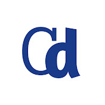{: style="width:7%"}](https://www.youtube.com/c/ContainerDays) [{: style="width:7%"}](https://www.youtube.com/c/priyankavergadia) 
[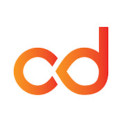{: style="width:7%"}](https://www.youtube.com/c/ContinuousDeliveryFoundation) [{: style="width:7%"}](https://www.youtube.com/c/TinaHuang1) [{: style="width:7%"}](https://www.youtube.com/c/AzureDevOps) [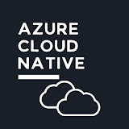{: style="width:7%"}](https://www.youtube.com/channel/UC2Pk9GcHhlVV0R9CQIU6gLw) [{: style="width:7%"}](https://www.youtube.com/c/AlibabaCloud) [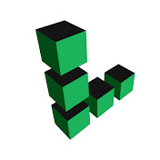{: style="width:7%"}](https://www.youtube.com/c/linode) [{: style="width:7%"}](https://www.youtube.com/channel/UCB5WMc2FfrxKzfd7XIODoMw) [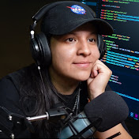{: style="width:7%"}](https://www.youtube.com/c/MadeByGPS) [{: style="width:7%"}](https://www.youtube.com/c/keptn) [{: style="width:7%"}](https://www.youtube.com/c/AnaisUrlichs) [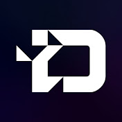{: style="width:7%"}](https://www.youtube.com/c/TheDigitalLifeTech) 
[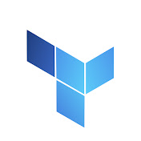{: style="width:7%"}](https://www.youtube.com/@azure-terraformer) [{: style="width:7%"}](https://www.youtube.com/@NedintheCloud) [{: style="width:7%"}](https://www.youtube.com/@NetBoxLabs) [{: style="width:7%"}](https://www.youtube.com/@techwithhelen) [{: style="width:7%"}](https://www.youtube.com/@ByteByteGo) [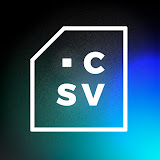{: style="width:7%"}](https://www.youtube.com/@DotCSV) [{: style="width:7%"}](https://www.youtube.com/@midulive) [{: style="width:7%"}](https://www.youtube.com/c/MaltCommunity)

